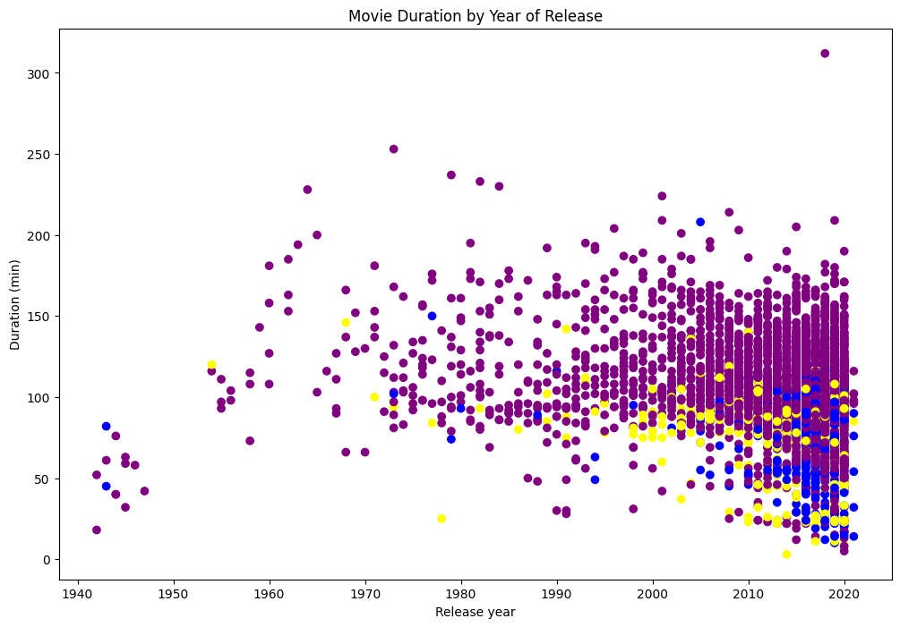

---

---

# Netflix Movie Duration Analysis
## Project Source

This project was completed as part of the Investigating Netflix Movies on DataCamp. The course provided the dataset and guided instructions for performing the analysis. I have implemented the techniques and skills learned from the course to conduct this analysis and present the findings.

## Overview

Netflix, one of the largest entertainment and media companies, has seen significant growth since its inception in 1997 as a DVD rental service. This project aims to investigate whether the average duration of movies on the platform has been declining over time. The analysis is based on data obtained from the Data Camp website.

## Achievements and Skills

- **Programming Concepts**: Implemented data cleaning, filtering, and exploratory data analysis techniques in Python.
- **Data Visualization**: Created visualizations to effectively communicate insights from the data.

## Context and Motivation

The motivation behind this project was to practice and showcase my data analysis skills while exploring an interesting question in the entertainment industry. By working on this project, I aimed to:

- Gain hands-on experience in data cleaning and analysis.
- Develop proficiency in Python programming for data analysis.
- Understand trends in movie durations on Netflix.

## Project Description

### Data

The dataset contains information on Netflix shows, including show ID, type, title, director, cast, country of origin, date added to Netflix, release year, duration, description, and genre.

### Data Cleaning and Analysis

I began by loading the dataset and examining its structure. Subsequently, I filtered the data to focus exclusively on movies. Further, I isolated movies with a duration of less than 60 minutes, considering them as "short movies."

### Visualization

To visualize the data, I assigned colors to movie genres (e.g., Children, Documentaries, Stand-up) and created a scatter plot of movie durations by their release years.

## Conclusion

Based on the analysis, it was observed that short movies (less than 60 minutes) are present in the Netflix dataset. The scatter plot revealed interesting patterns in movie durations over the years, with different genres represented by distinct colors.There is a trend towards shorter movies over time, the decrease in duration is not drastic.

## Portfolio Reflection

This project showcases my ability to work with real-world data, perform data cleaning and analysis, and effectively communicate insights through visualizations. It highlights my growing proficiency in Python programming and data analysis techniques.

---

  
